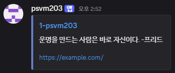
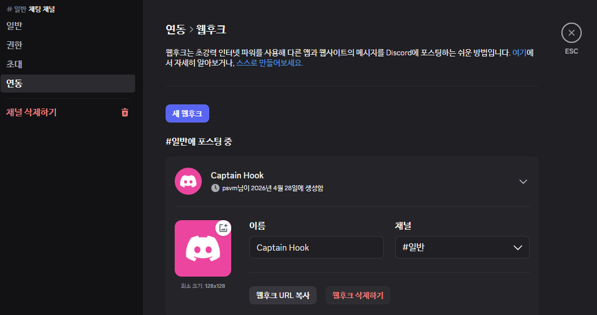
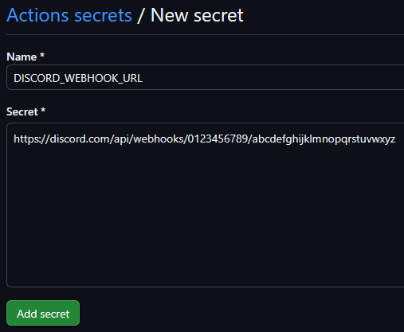

## 소개

**PR to Discord**는 깃허브 풀 리퀘스트 작성 시 디스코드 채널에 관련 정보를 알려주는 깃허브 액션입니다.  
알고리즘 스터디 [AlgoLeadMe](https://github.com/AlgoLeadMe)에 사용할 목적으로 제작되었습니다.  
풀 리퀘스트를 작성하면 작성자의 닉네임과 프로필 이미지를 가진 디스코드 봇이 랜덤 색상, PR 링크, 문제 링크, 랜덤 명언이 포함된 메시지를 전송합니다.  

<br>

## 미리보기



<br>

## 사용법

### 1. 디스코드 웹후크 생성



디스코드 채널 > 채널 편집 > 연동 > 웹후크에 들어가면 새로운 웹후크가 자동으로 생성됩니다.  
생성되지 않는 경우 '새 웹후크'를 눌러 웹후크를 생성합니다.  
웹후크 URL을 복사합니다.  

<br>

### 2. 깃허브 시크릿 등록



레포지토리 Settings > Secrets and variables > Actions > Repository secrets > New repository secret에서 Secret에 복사한 URL을 붙여넣습니다.  

<br>

### 3. 워크플로우 작성

`.github/workflows/discord.yml` 파일을 생성합니다.

```yaml
name: PR to Discord

on:
    pull_request_target:
        types: [opened, reopened]

jobs:
    notify:
        runs-on: ubuntu-latest
        steps:
            - uses: psvm203/PR-to-Discord@main
              with:
                  discord_webhook_url: ${{ secrets.DISCORD_WEBHOOK_URL }}
```

이제 풀 리퀘스트가 open/reopen될 때마다 디스코드에 알림 메시지가 전송됩니다.  

<br>

## 입력값

| 이름 | 필수 | 설명 |
|---|---|---|
| `discord_webhook_url` | O | 디스코드 채널의 웹후크 URL |

<br>

## 명언 목록

`quotes.txt`에 100개의 명언이 포함되어 있습니다.  
추가하고 싶은 명언이 있으시다면 [풀 리퀘스트](https://github.com/psvm203/PR-to-Discord/pulls)를 남겨주세요!
